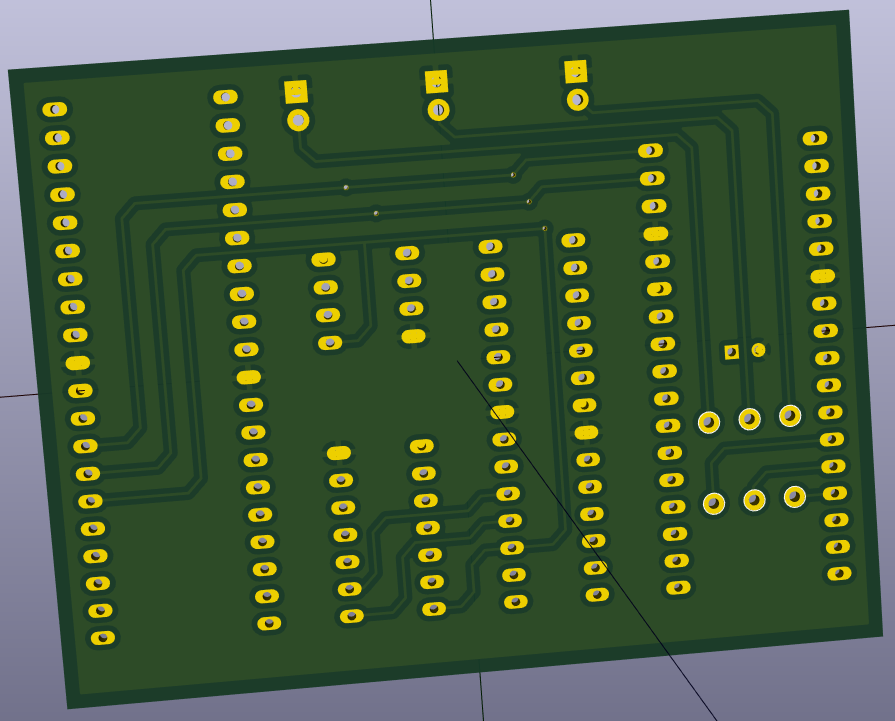

# arduino micro as attiny/atmega programmer

a simple pcb with a few sockets to program attiny/atmega microcontrollers from
an arduino micro

# supported atmel chips

* ATtiny 24/44/84
* ATtiny 25/45/85
* ATmega 48/88/168/328
* ATmega 164/324/644/1284

# usage

## one-time initial setup

* if you want to program an ATtiny and haven't set that up yet, see here: https://github.com/stackmagic/attiny/blob/master/README.md

## prepare the programmer

* plug in your arduino micro and connect it to the pc
* start up the arduino IDE
* connect your arduino micro
* open up the programmer sketch: `File > Examples > ArduinoISP`
* change the line `#define RESET SS` to `#define RESET 10`
* select `Tools > Board > Arduino Micro`
* burn the programmer to your Arduino Micro with `File > Upload`
* verify the RDY led is pulsing
* select your micro as programmer `Tools > Programmer > Arduino as ISP`

once this is done, you can program as many chips as you want

## burn it

* plug in the chip to program (make sure there's just 1 chip on the board ;))
* open the sketch to program to the chip
* select the correct target board through `Tools > Board > ...`
* burn the sketch using `File > Upload using Programmer`
* the PRG led should light while the program is written
* you're done!

# screenshot

# further reading

## arduino micro ISP

* http://forum.arduino.cc/index.php?topic=156863.15
* http://www.arduino.cc/en/uploads/Main/arduino-micro-schematic.pdf
* https://camo.githubusercontent.com/87e06ff5c55ebb9498f5a3f7f232796a69259489/68747470733a2f2f7261776769746875622e636f6d2f426f756e692f41726475696e6f2d50696e6f75742f6d61737465722f41726475696e6f2532304d6963726f25323050696e6f75742e706e67

